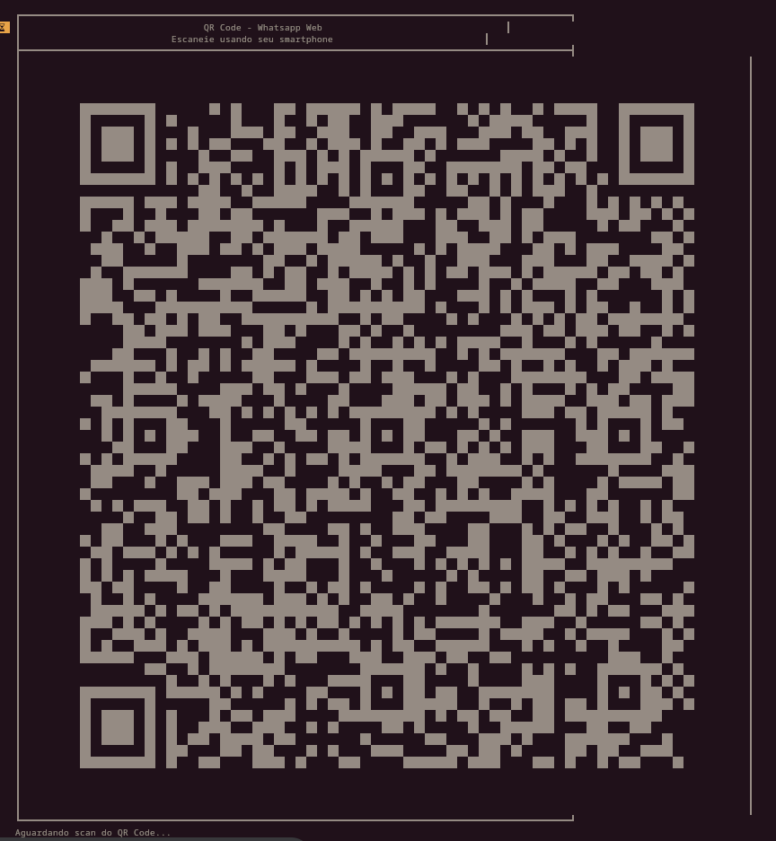

# Rotina para envio de Mensagens de Whatsapp

Esse programa foi escrito em GO para envio de mensagens pelo Whatsapp com uma programação prévia em Json.

Utilize o compose.yaml para executar as funções.

# Instalar
Usar o docker-compose
> docker-compose up -d

# Fazendo funcionar
Em seguida você deve escanear o QRCode com seu Whatsapp.
Para isso, você terá 1 minutos para ver o log e escanear.

> docker-compose logs whatsapp -f

Em seguida, você deverá ver o log do Whatsapp para escanear o QRCode, conforme mostra a imagem abaixo.

# Mensagens
Para ver como formatar as mensagens. Veja o exemplo do arquivo [mensagens.json](data/mensagens.json)

É importante lembrar das seguintes variáveis:
- id - somente identificação. Definir seriado 1, 2, 3...
- destinatario - Nome do destinatário. Não usar número. O destinatário deverá estar em seus contatos no Whatsapp.
- conteudos - Mensagens escolhidas de forma aleatória
- ultimo_envio - Não precisa definir nada. Atualizada de acordo com o uso
- horario_envio - Horário em que a mensagem será enviada. Formato 24:00
- dia_semana - Dias que as mensagens serão enviadas. 0 (domingo) a 6 (sábado).

